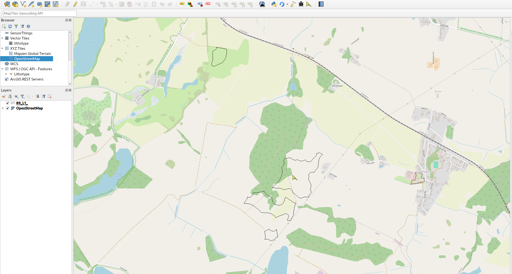
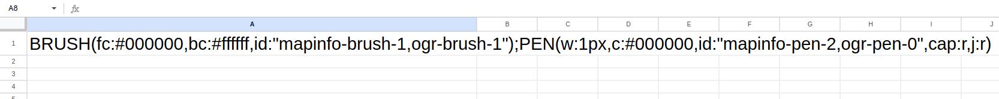

# NextGIS Ogrstyle

A QGIS plugin. Get embedded OGRStyle for a feature.

QGIS plugins page: https://plugins.qgis.org/plugins/ogrstyle/ 

## Capture and show OGRStyle in one click

## YouTube

## License

This program is licensed under GNU GPL v.2 or any later version.

## Commercial support

Need to fix a bug or add a feature to NextGIS Ogrstyle? 

We provide custom development and support for this software. [Contact us](https://nextgis.com/contact/?utm_source=nextgis-github&utm_medium=plugins&utm_campaign=copycoords) to discuss options!

